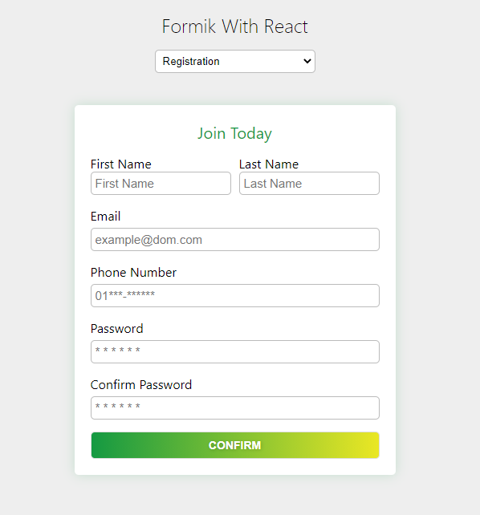

# HTML Form in react with formik

```
npm install
npm start
```

### Login Form

For this login form I have use "useFormik" Hook and custom validation function for validate input fields

```
import { useFormik } from "formik";
```


### Registration Form

For this registration form I have use Formik Components. I use yup schema for validation

```
import { Formik, Form, Field, ErrorMessage } from "formik";

import * as Yup from "yup";
```


